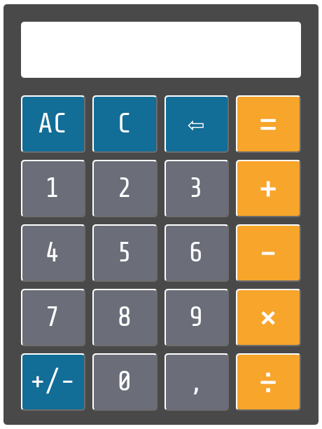
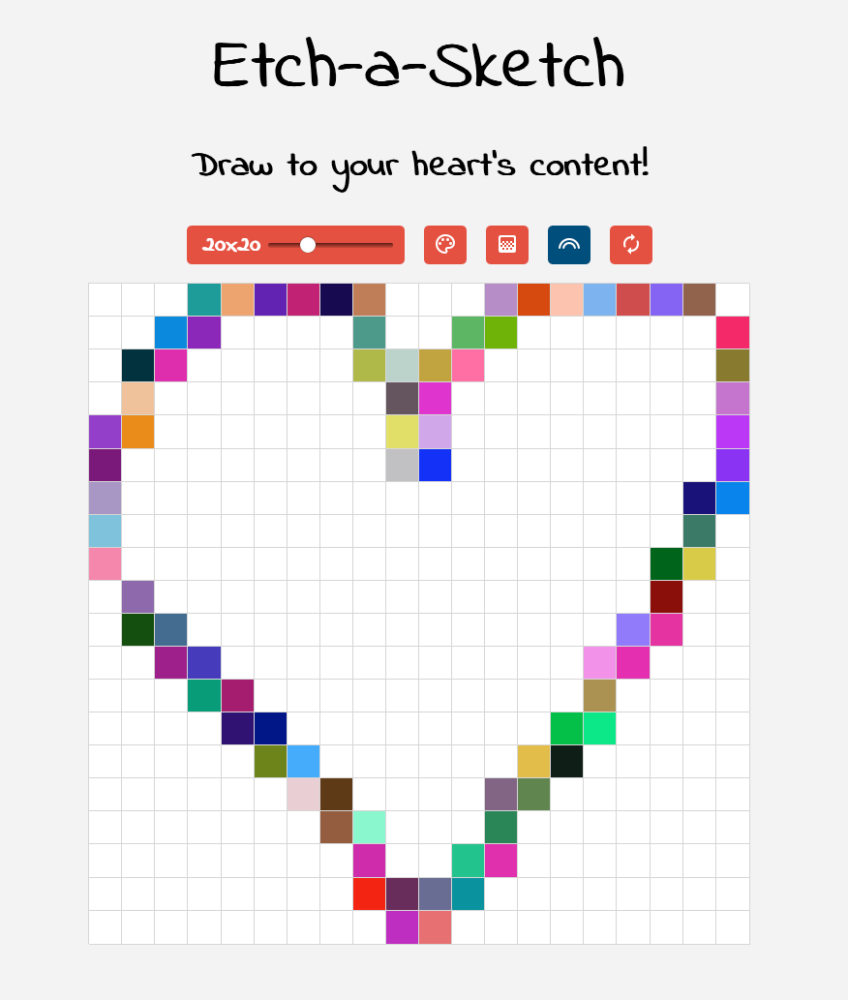
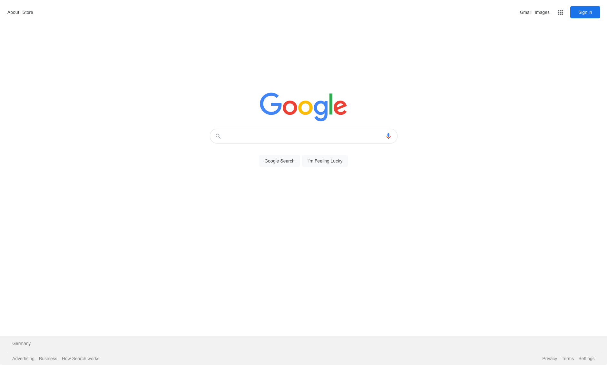
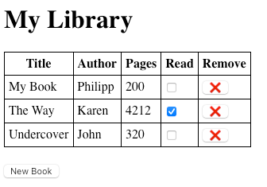
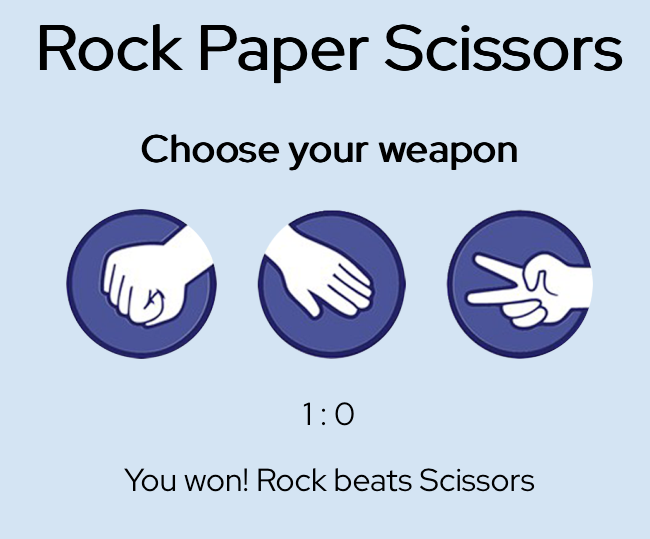
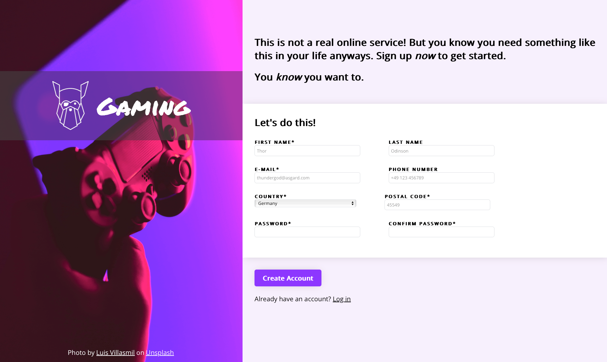
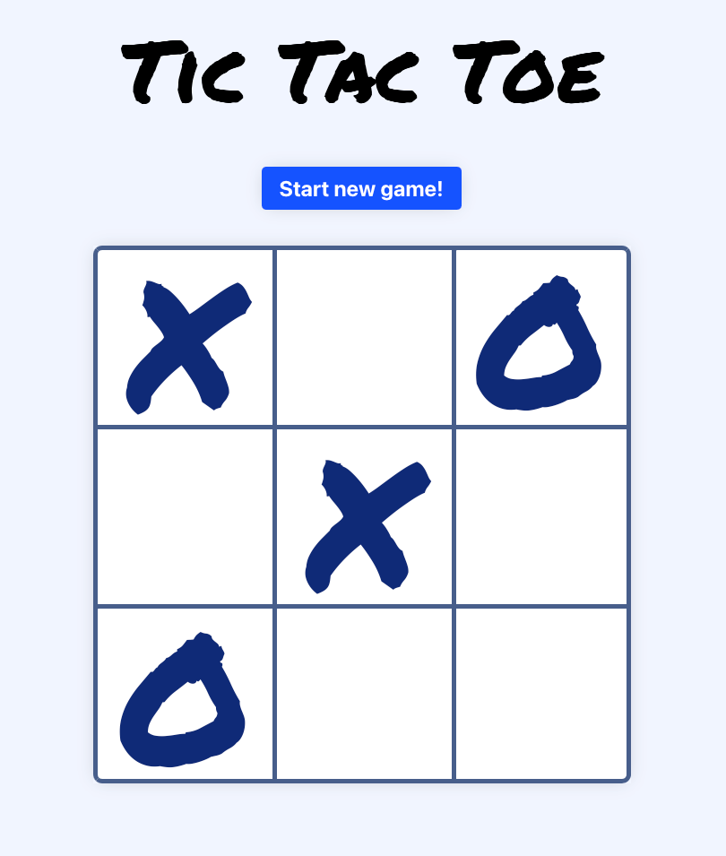

# The Odin Project exercises

This repository contains a collection of projects and exercises covering a variety of programming concepts and web development skills. All of these were completed as part of [The Odin Project's curriculum](https://www.theodinproject.com/). Below is an overview of the projects and the skills demonstrated in each.

## Projects

### Admin Dashboard

A simple admin dashboard layout built using HTML and CSS.

**Skills:** CSS Grid and Flexbox layout, responsive design, modern UI styling.

<details>
  <summary>Screenshot</summary>
  <p align="center">
    
  </p>
</details>

### Calculator

A functional calculator built with JavaScript.

**Skills:** DOM manipulation, event handling for keyboard inputs.

<details>
  <summary>Screenshot</summary>
  <p align="center">
    
  </p>
</details>

### Etch-a-Sketch

An interactive drawing app inspired by the classic Etch-a-Sketch toy.

**Skills:** Event listeners, CSS grid, color manipulation, DOM manipulation.

<details>
  <summary>Screenshot</summary>
  <p align="center">
    
  </p>
</details>

### Google Homepage Clone

A visual clone of Google's search homepage.

**Skills:** HTML and CSS structuring, Chrome DevTools debugging.

<details>
  <summary>Screenshot</summary>
  <p align="center">
    
  </p>
</details>

### Library App

A simple library application to store and manage books.

**Skills:** JavaScript form handling, local state management.

<details>
  <summary>Screenshot</summary>
  <p align="center">
    
  </p>
</details>

### Rock-Paper-Scissors

A browser-based Rock-Paper-Scissors game.

**Skills:** JavaScript logic implementation, event-driven programming, DOM updates.

<details>
  <summary>Screenshot</summary>
  <p align="center">
    
  </p>
</details>

### Sign-up Form

A basic user sign-up form with validation.

**Skills:** HTML form validation, CSS styling, JavaScript input handling.

<details>
  <summary>Screenshot</summary>
  <p align="center">
    
  </p>
</details>

### Tic-Tac-Toe

A web-based version of the classic tic-tac-toe game.

**Skills:** DOM manipulation, simple game logic implementation, event handling.

<details>
  <summary>Screenshot</summary>
  <p align="center">
    
  </p>
</details>

### Ruby Exercises

A collection of Ruby exercises and mini-projects.

- **Basic Ruby:** Sorting algorithms, Caesar cipher, stock picker, substrings.
- **Binary Search Tree:** Implementation of tree-based searching.
- **Connect Four:** Terminal-based version of the classic game.
- **Hangman:** A command-line word-guessing game.
- **Knight’s Travails:** A shortest-path algorithm using graphs.
- **Linked List:** A linked list data structure implementation.
- **Mastermind:** CLI version of the classic code-breaking game.
- **My Enumerable:** Custom implementation of Ruby’s enumerable methods.
- **Tic-Tac-Toe:** A command-line tic-tac-toe game.
- **Recursion:** Fibonacci sequence, merge sort.

**Skills:** Algorithm development, recursion, OOP, data structures, test-driven development (TDD) with RSpec.

## Technologies Used

- **Frontend:** HTML, CSS, JavaScript
- **Backend:** Ruby
- **Testing:** RSpec (Ruby projects)
- **Tools:** Git, Chrome DevTools, ESLint

## How to Run

Clone the repository:

```sh
git clone https://github.com/insomniac2305/the-odin-project-exercises.git
cd the-odin-project-exercises
```

### Web projects

Open the project folder and open `index.html` in a browser.

### Ruby projects

Run

```sh
ruby filename.rb
```

or use RSpec for testing where applicable:

```sh
rspec spec/
```
